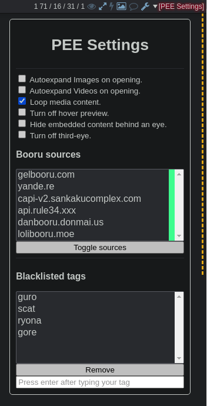
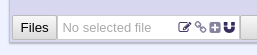
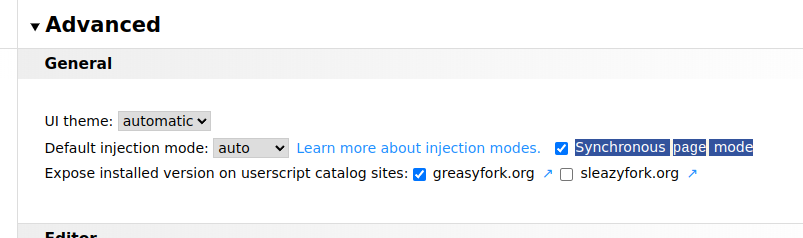

PNG Extra Embedder (PEE)
========================

*Subsequently 'lolipiss' (**LOL** **I** **p**Want **i**To **s**Kill **s**Jannies)*

Can embed any file in a PNG/WebM/GIF and upload it to a third-party host through 4chan.
Requires a userscript manager, such as ViolentMonkey.
It should work with 4chan's native extension but 4ChanX is highly recommended as it is much more tested.
Also supports desuarchive.

How to Install
==============

Note: 4chanX isn't a hard requirement, just recommended because it's overall a nicer experience. If you don't want to use 4chanX, make sure the native 4chan extension is enabled in your settings.

## Teh olde way

- Make sure you're using a decent Webkit-based browser (Chromium derivatives) or Firefox.
- [Install ViolentMonkey](https://violentmonkey.github.io/get-it/) (it is preferable to TamperMonkey(closed source) and GreaseMonkey(abandonned shit)), use [ViolentMonkey Beta](https://violentmonkey.github.io/get-it/#beta-release) if you want to spite the b4k meanie admin (based & redpilled). Be sure to read the trouble shooting section to know how to set this up.
- [Install 4chanX (recommended)](https://www.4chan-x.net/builds/4chan-X.user.js)
- Use the prebuilt [main.user.js](https://git.coom.tech/coomdev/PEE/raw/branch/%E4%B8%AD%E5%87%BA%E3%81%97/main.user.js)

## The newer way (WIP)

- [Install 4chanX (recommended)](https://www.4chan-x.net/builds/4chan-X.user.js)
- Install the correct WebExtension for your Browser ([Firefox](https://git.coom.tech/coomdev/PEE/raw/branch/%E4%B8%AD%E5%87%BA%E3%81%97/pngextraembedder-0.211-an+fx.xpi) or [Chrome-based](https://git.coom.tech/coomdev/PEE/raw/branch/%E4%B8%AD%E5%87%BA%E3%81%97/PEE-chrome.crx))

How to Build 
============

(You only need to care about this section if you're auditing the code or contributing to development)

`npm i` and `npm run build`
then install the generated main.user.js

How to use
==========

Posts with an embedded image/video will have an colored dashed line on their right. Golden means the file is external (ie. a booru), and pink means it was a file embedded in the post file.

this screenshot is outdated, UI has changed a little but I'm too lazy.

In the quick reply form, a magnet icon will appear.
Clicking it will allow you to add files to attach to the file that will be uploaded and shown on 4chan.
Hovering on the magnet will reveal a pencil icon, that will attach the content of your message box to the file, use it as a way to hide messages.

Your embeds will be attached as you add them after you've selected a file, but can be prepared before selecting your main file.

By default, you can add up to 5 attachments to a file. This limit can be raised, but keep in mind others using the default settings will only see your 5 first files, unless they themselves raised that limit in the settings.

### Thread Watcher

The "thread watcher" allows you to find threads that contain embeds.
A lot of the results might be false positives from people posting directly files from boorus, so you can adjust the perceptual hash filter settings to reduce that. Setting it to a very high value ensures results will be exclusively made of direct link embeds.

The "Contribute" checkbox makes your browser report posts with embeds you come accross during your regular browsing to [telepee](https://git.coom.tech/coomdev/telepee). It is recommended to enable it if you frequently post as it'll make your posts more visible to other extension users.

#  TroubleShooting

## [NEW] b4k

b4k is a meanie, i disabled lazyloading of thumbnails, heck you person of african american descent.

**ACK!**

If you want to use b4k, you will get warning prompts. I added a ton of warning screen so it shouldn't happen to you.
Switch to the beta and enable this setting. If you're using TamperMonkey, it has something similar called "Instant Injection"

## It doesn't work

I can't help if you don't give me any information, see below.
As mods are banning any kind of discussion about this extension, please open an issue on this repository. Account creation is quick and requires no email verification.

## "I am using [BROWSER] and [USERSCRIPT MANAGER] and when I do [X]..."

That's better. Officially, all developpment is made and tested on latest Chromium with VM. I'm willing to provide support and help for FF and other Chromium-based browsers as long as you use ViolentMonkey and provide as much information as you can: console logs, screenshots, versions...

## Something else

Open an issue on this repository, you need an account but email verification is disabled.

## It's slow

The slowest machine I have available is an 8GB 2011 Sandy Bridge i5 with a 1660Ti, the only way I can tell something is slow is if you post a performance profile for me to study. (DevTools > Performance > Reload and Start Profiler > Save Profiler).

There are parts where slowness is unavoidable, for example if you have a slow internet connection and enabled preloading (what the h*ck are you doing?).

Even without preloading enabled, PEE still makes many requests at the start of a page as it fetches a small initial chunk of png/webm/gif files to know if something is embedded in there, only progressing further when something is detected. It also does boorus/catbox requests for the corresponding filenames.

## Why is it so big

The file-type detection package is huge as it detect many file types, but also depends on node constructs that are also huge by themselves. There's also a webm parser that's relatively big that's used for embedding/extracting files in/from webms. There's also the svelte UI that compiles down to simple javascript.

## How do I know it's not a botnet???

You're free to audit the code. You don't have to audit the 18000 loc file, you just need to audit the 2000-something lines of typescript code in the `src` folder, build it as instructed, and compare it to the one distributed. If you're incapable of doing that, chances are you're already using unauditable extensions with backdoors anyway? dumb schizoposter.

## But embedding is a bannable offense!!!11

Yeah, well use at your own risk, you double baka. 

While it is true PEE used to allow you to embed complete files in your uploads, recent changes have made it much less practical (limited to really small files), so it's falling back to linking external content hosted on pomf-clones such as catbox.

Links are much smaller and as some PNG editing software injects their own metadata, 4chan is basically required to allow some little amount of it to go through, lest they inconvenience a lot of their users, so a link-embedding detection method cannot be generalized, meaning they rely on unpaid janny labor to moderate this kind of content.

Just be discreet about it and you won't get into trouble.

# H*ck jannies

/cumg/ threads are still banned despite being tolerated for over a year and the current ones being made not breaking any rule or even daring to thread on a grey line.

Their OPs are wrongfully being banned under the pretense of using proxies/VPNs, or evading bans that didn't exist in the first place.

# Supports

Third Eye
---------

Third eye filenames are supported.
Filename just need to be made of 32 hex characters that correspond to a filename in any of the supported boorus.

Catbox
------

Supports:
- Base64 filenames
- [\<host>=\<file>] filenames
- [\<type>=\<URL>] filenames (URL must be one of the supported hosts (catbox, pomf, zzzz...))
    * \<type> is ignored and is inferred from the file content

Hydrus
------

By setting an API Key, you can automatically embed random files (prefiltered by your tags) into your uploads. You can also directly search, pick and embed from your Hydrus database from within PEE.

To generate an API Key, first enable the Hydrus Client API:

- Services > Manage Services > Client API

Leave the default port at 45869, enable CORS headers (required), and disable "allow non-local connections" (optional, but better security)

Apply your changes, then:

- Services > Review Services > Local > Client API > Add > Manually

Take note of the Access Key, enable the "Search for files" permission, apply your changes.

Then give this Access key to PEE where it's asked for.